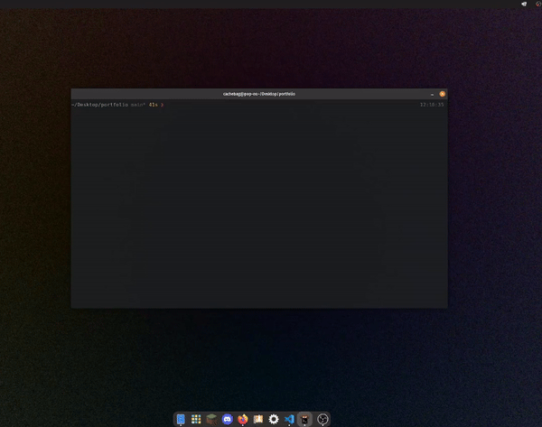

# Loki 📗



**Loki** is a tool for developers and students with minimal Git experience, that allows you to step through your repository's history and enter a virtual environment at any commit in your project's lifetime. You can review older versions, test and replicate previous features, or explore past implementations without the need for complex Git commands or risking changes to your current project state.

## Curent State and potential contributions:

- VScode doesn't exactly work right now. I can't seem to figure out why, but when attempting to select Vscode, the app opens and attempts to write files like this:
  - 
- I think cleaning up the temp branches after the user exits the environment could be done in a better fashion.
- Selecting a path to an 'Other' editor doesn't work how I'd like it to. Currently, when users attempt to type the path to their "Other" editor, the interface doesn't support autocompletion or correct navigation to hidden directories (e.g., ~/.home/Desktop/etc). This makes it challenging for users to correctly specify paths to their custom editors, especially if the user isn't familiar with the exact location of their editor.

  
## Features:
- Browse your project's commit history with details: Date → Commit Message → Shortened Hash → Author.
- Select any commit to load its codebase in a temporary environment.
- Open the code in your preferred text editor.
- Make changes, test, or run old code with no impact on your current project.
- Exit the environment to return to your project's latest state.

## Requirements:
- **GCC**
- **Libgit2**
- **Ncurses**
- **Make** 

## Installation Instructions 

1. **Install dependencies:**

   ```bash
   brew install gcc libgit2 ncurses
   ```

   **Linux**
   ```zshrc
   sudo apt-get install build-essential libgit2-dev libncurses5-dev libncursesw5-dev
   ```

3. **Clone the Loki repository:**

   ```bash
   git clone git@github.com:alhakimiakrm/Loki.git
   cd Loki
   ```

4. **Build Loki:**

   ```bash
   make
   ```

## Usage

1. Move the `loki` executable to your desired project directory. (i.e. ```cp ./loki ../example-project```)
   
2. Run Loki with:

   ```bash
   ./loki
   ```

4. Choose your preferred text editor.

5. Use the arrow keys to navigate through your commit history and press `Enter` to select a commit and enter the codebase in a temporary environment.

6. After you're done, save your changes and exit the editor to return to the latest state of your project. None of the changes you make in your temp enviornment will apply to your project's latest state.

---
